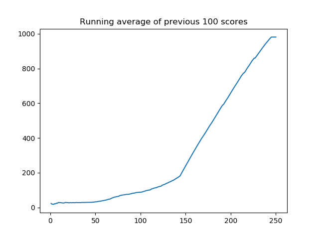

# Major_ML_models_implemented_in_PyTorch

## Soft Actor Critic
In this repository, A straightforward Pytorch implementation of the Deep Reinforcement Learning Algorithm such as Soft Actor Critic are presented for the one trying to learn Reinforcement Learning algorithms as simple as possible. I would be happy to answer any questions. 

Here are the learning results for inverted pendulum environment trained by Soft Actor Critic:

  

## Generative Pre-trained Transformer

Simply can run test files in GPT folder.  

